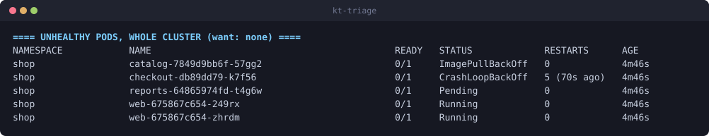
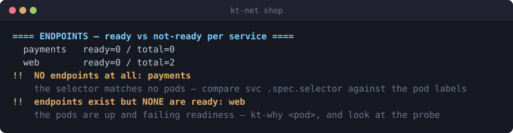

# glovebox

A disposable, agent-capable container for troubleshooting a Kubernetes cluster
you did not build.

You are handed a kubeconfig, maybe an SSH key, and a cluster that is broken —
a take-home assessment, a customer's incident, an on-call handover into
somebody else's platform. The obvious move, `export KUBECONFIG=./kubeconfig` in
your own shell, is the wrong one twice over: you have put an unknown credential
next to your own contexts, and one absent-minded `kubectl delete` in the wrong
terminal is a story you have to tell afterwards.

This is the other move. Work inside a container that has everything you need
and none of your credentials, then throw it away.

There are two ways to use it, and both matter:

- **You drive.** A real shell — tab completion, `k9s`, `stern`, `aws`, and a
  layered triage toolkit that turns each question ("why is this pod not
  running?") into one word.
- **An agent drives.** Claude Code runs inside the same container, behind the
  same guard rails, following a written diagnostic methodology, leaving a
  transcript of every command it ran.

## 60 seconds

```bash
git clone https://github.com/danieloa/glovebox.git
cd glovebox
./gb build                       # ~2GB, a few minutes, once

cd ~/some-assessment             # the directory holding their kubeconfig
~/glovebox/gb shell           # you troubleshoot
```

Inside:

```
kt-env          # who am I, can I reach it, what am I allowed to do
kt-triage       # every layer of the stack, one screen
kt-why <pod>    # why is this specific thing not running
kt-help         # the other 21
```

With an API key exported, the agent is available too:

```bash
export ANTHROPIC_API_KEY=sk-ant-...
~/glovebox/gb agent "the checkout service is down — what is wrong?"
~/glovebox/gb agent --fix "fix the readiness probe on web"   # asks first
```

## What it looks like

`kt-triage` against a cluster carrying five deliberate, independent faults
(`hack/selftest-faults.yaml`) — every one of them on a single screen, before
you have touched anything:



Two of those five present identically from outside — "the service is
unreachable" — and `kubectl get svc` cannot tell them apart. `kt-net` can:



`payments` has **no endpoints at all** — its selector matches nothing, which is
a label typo in the Service. `web` has **endpoints that are all not-ready** —
the pods are up and failing their readiness probe, so Kubernetes is deliberately
pulling them out of the Service. Same symptom three layers up. Completely
different fixes.

Both images are generated from a live cluster by `hack/make-screenshots.sh`, not
retouched by hand — for a tool whose whole output is diagnostic text, a
screenshot nobody can reproduce would not prove much.

## Why the shell matters

The version of this I actually took into two platform-engineering take-homes
was a `debian:12-slim` image with `kubectl` and `jq` in it. It worked, and it
was miserable: no tab completion for anything, no `aws`, no `k9s`, `vim-tiny`,
and a bare `$` prompt that told you nothing about which cluster you were about
to run a command against. Forty minutes is not long enough to also fight your
own tools.

So: completions generated from the installed binaries (they cannot drift),
timestamped history that survives as your write-up, and a prompt that shows
mode, context and namespace — read from the kubeconfig file rather than by
calling the API, because a prompt that hangs for thirty seconds when the API
server is the broken thing is worse than no prompt at all.

| | |
|---|---|
| **Kubernetes** | `kubectl` (+ completion), `k9s`, `stern`, `helm`, `kustomize`, `krew`, `kubectx`/`kubens` |
| **AWS** | `awscli v2` (+ completion), `eksctl` |
| **Network** | `dig`, `tcpdump`, `mtr`, `traceroute`, `socat`, `nc`, `telnet`, `httpie`, `ss` |
| **System** | `strace`, `lsof`, `htop`, `procps`, `ssh`, `rsync` |
| **Shell** | bash-completion, `fzf`, `ripgrep`, `bat`, `jq`, `yq`, real `vim` |
| **Agent** | Claude Code, three skills, three permission profiles |

Roughly 2GB. Versions resolve to the current upstream release at build time;
`hack/pin-versions.sh` freezes them into the Dockerfile, which is what you want
before anything you cannot afford to rebuild during.

## The toolkit

Read-only verbs, layered bottom-up through the stack. `kt-help` lists them all.

```
ORIENT     kt-env          identity, reachability, and your own RBAC
           kt-ns [ns]      set the target namespace (no arg = auto-detect)
           kt-triage       *** START HERE *** every layer, one screen

NODES      kt-nodes        Ready status + reason + pressure + taints
           kt-node <n>     everything about one node
           kt-ssh <n>      shell onto a node (resolves name -> address)
           kt-kubelet <n>  kubelet unit, journal, disk, runtime, clock skew

WORKLOADS  kt-app          deploy -> replicaset -> pod, in rollout order
           kt-why <pod>    *** why is this pod not running ***
           kt-crash        every crash-looper, with exit codes
           kt-image        image pull failures, with the exact image reference
           kt-logs <re>    multi-pod tail (stern)

NETWORK    kt-net          services, endpoints (ready vs not-ready), netpol, CNI
           kt-dns          CoreDNS health + a real in-cluster lookup
           kt-ingress      class, controller, rules, backends, logs
           kt-cert         cert-manager chain, in issuance order
           kt-tls <host>   what certificate is actually served
           kt-http <url>   end-to-end request with phase timings

CAPACITY   kt-storage      PVCs that will not bind, and why
           kt-rbac [sa]    what you, or a ServiceAccount, can actually do
           kt-res          capacity vs requests, limits, OOMKills
           kt-events       warnings, deduplicated, newest last

EVIDENCE   kt-snapshot     dump everything to files — write-up, and agent input
           kt-diff <f>     server-side dry-run: what a fix would change
```

Plus `aw-*` for the AWS layer under an EKS cluster — `aw-who`, `aw-eks`,
`aw-vpc` (subnet free-IP counts, the invisible cause of half of all
`FailedCreatePodSandBox`), `aw-sg`, `aw-irsa`, `aw-ecr`, `aw-triage`.

Each verb bundles the several commands that actually answer one question, so a
single word gets you the whole evidence set instead of a half-remembered
sequence under time pressure. Section banners state an expectation rather than
a label — `NODES (want: all Ready)` — because under pressure you read output
looking for a mismatch, and the header should tell you what you are matching
against. None of them write to the cluster.

## The agent

`gb agent "<question>"` runs Claude Code inside the container with:

- **the same guard rails you have.** The `kubectl` and `aws` on its `PATH`
  refuse mutating verbs unless the mode allows them. A refusal is a policy
  decision it is told not to route around.
- **a methodology, not just tools.** The `k8s-triage`, `aws-eks-triage` and
  `incident-report` skills encode the order of investigation, the signals worth
  reading (exit 137 vs 143; `Ready=False` vs `Ready=Unknown`; a Service whose
  endpoints exist but are not ready), and the requirement to separate what was
  observed from what was inferred.
- **a transcript.** Every command it ran, allowed or refused, in
  `/work/gb-audit-*.log`.

It is told to gather all the evidence before concluding anything, because these
environments usually contain several independent faults, and a fix applied
mid-diagnosis destroys the evidence for the ones you have not found yet.

`kt-snapshot` exists partly for the agent: reading thirty files off disk is
faster and cheaper than thirty round trips to an API server, and it means the
analysis runs against a consistent point-in-time view rather than a cluster
shifting underneath it.

## Modes, and what actually enforces them

| Mode | `kubectl` can | Used by |
|---|---|---|
| `ro` | read | `gb shell --ro`, `gb agent --ro` |
| `probe` | + `exec`, `port-forward`, `debug` — no API object is modified | **default** |
| `rw` | everything | `gb shell --rw`, `gb agent --fix` (confirms first) |

`probe` is the default because most real diagnosis needs to curl a service from
inside a pod, and none of that changes anything.

Enforcement is a wrapper on `PATH` that scans the whole argument vector — not
just `$1`, because `kubectl -n kube-system --context=prod delete pod x` hides
the verb in position five — and splits mixed commands by subcommand:
`config view` reads, `config set-credentials` does not; `rollout status` reads,
`rollout restart` does not. `--as` is refused outside `rw` regardless of verb,
since impersonation defeats the point of a scoped identity.

**These guards stop mistakes, not attackers.** Anything holding the kubeconfig
can talk to the API server directly without going near `kubectl`, and no
CLI-layer control can change that. For a boundary the server enforces, scope the
credential:

```bash
./gb scope        # ServiceAccount + 'view' ClusterRole -> kubeconfig.readonly
```

Now read-only is a fact about the cluster rather than a promise about the
client. [`docs/SECURITY.md`](docs/SECURITY.md) sets out the whole threat model,
including what it deliberately does not cover.

## Usage

```
./gb build [--no-cache]         build the image
./gb shell [dir] [--rw|--ro]    interactive shell        (default: probe)
./gb agent [--fix] "<q>"        one-shot agent run       (default: probe)
./gb agent                      interactive Claude in the container
./gb scope [sa-name] [ns]       mint a read-only kubeconfig via RBAC
./gb doctor                     check the host is ready
./gb nuke                       remove the image
```

The bundle directory is mounted **read-only** and defaults to `$PWD`, so
`cd ~/some-assessment && gb shell` is the normal way to use this. The container
copies what it needs into a writable `/work`: `kubectl` writes to the
kubeconfig, `ssh` refuses a key it cannot `chmod`, and you never modify the
artifacts you were sent.

Reaching a cluster the defaults cannot see:

```bash
GB_DOCKER_ARGS="--network kind" ./gb shell    # kind / k3d internal addresses
GB_DOCKER_ARGS="--dns 10.0.0.1" ./gb shell    # split-horizon resolver
```

## Try it on a broken cluster

There is nothing like a broken cluster for testing a tool that diagnoses broken
clusters. The fixture plants five independent faults: a `CrashLoopBackOff`, an
`ImagePullBackOff`, an unschedulable pod, a failing readiness probe, and a
Service selector typo.

```bash
kind create cluster --name gb-selftest
kubectl apply -f hack/selftest-faults.yaml

mkdir -p /tmp/gb-bundle
kind get kubeconfig --name gb-selftest --internal > /tmp/gb-bundle/kubeconfig

GB_DOCKER_ARGS="--network kind" ./gb shell /tmp/gb-bundle
# then: kt-triage   — all five should be on one screen

kind delete cluster --name gb-selftest
```

## Requirements

- Docker (or anything that speaks the same CLI). Built and tested on
  `linux/amd64`; `linux/arm64` is handled throughout and every upstream asset
  resolves for it, but that build path has not been exercised end to end.
- `kubectl` on the host only for `gb scope`; everything else runs in the
  container.
- `ANTHROPIC_API_KEY` only for `gb agent`. The toolkit works fully without one.
  The key is passed in at run time and never written to an image layer.

## Layout

```
Dockerfile               six layers, ordered so editing a script does not re-download 400MB
gb                       the host-side driver — every docker flag, and why it is there
image/
  install-tools.sh       the binary toolchain: arch mapping, version resolution
  guard-kubectl.sh       the verb allow-list
  guard-aws.sh           the same, prefix-based, for the AWS CLI
  entrypoint.sh          stages the read-only bundle into a writable /work
  shellrc.sh             completion, history, prompt, aliases
toolkit/
  k8s-triage.sh          the kt-* verbs
  aws-triage.sh          the aw-* verbs
claude/
  AGENT.md               operating instructions injected into every agent run
  settings.{ro,probe,rw}.json
  skills/                k8s-triage · aws-eks-triage · incident-report
  run-agent.sh
docs/
  SECURITY.md            the threat model, stated honestly
  INTERVIEW.md           how to offer this in an assessment without it backfiring
hack/
  pin-versions.sh        freeze tool versions before you need them
  selftest-faults.yaml   five deliberate faults, for testing the toolkit
  make-screenshots.sh    regenerate the README images from a live cluster
  ansi2svg.py            ANSI terminal output -> SVG
```

Everything is commented for the reader who arrives in six months and asks "why
is `socat` in here" or "why does this download to a file instead of piping into
`tar`". The answers are in the files.

## Licence

Apache License 2.0 — see [LICENSE](LICENSE) and [NOTICE](NOTICE).

The image installs third-party binaries at build time (`kubectl`, `helm`,
`k9s`, `stern`, `kustomize`, `krew`, `kubectx`/`kubens`, `yq`, `eksctl`, the AWS
CLI, Claude Code); each remains under its own licence, and none of their source
is redistributed here.
